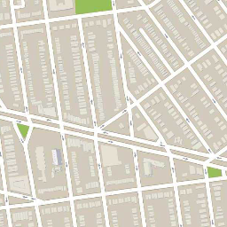

# Pix2Pix using PyTorch

The Pix2Pix Generative Adversarial Network, or GAN, is an approach to training a deep convolutional neural network for image-to-image translation tasks.The GAN architecture is comprised of a generator model for outputting new plausible synthetic images, and a discriminator model that classifies images as real (from the dataset) or fake (generated). The discriminator model is updated directly, whereas the generator model is updated via the discriminator model. As such, the two models are trained simultaneously in an adversarial process where the generator seeks to better fool the discriminator and the discriminator seeks to better identify the counterfeit images.

The Pix2Pix model is a type of conditional GAN, or cGAN, where the generation of the output image is conditional on an input, in this case, a source image. The discriminator is provided both with a source image and the target image and must determine whether the target is a plausible transformation of the source image.

The generator is trained via adversarial loss, which encourages the generator to generate plausible images in the target domain. The generator is also updated via L1 loss measured between the generated image and the expected output image. This additional loss encourages the generator model to create plausible translations of the source image.

The Pix2Pix GAN has been demonstrated on a range of image-to-image translation tasks such as converting maps to satellite photographs, black and white photographs to color, and sketches of products to product photographs.

# Satellite to Map Image Translation Dataset

This is a dataset comprised of satellite images of New York and their corresponding Google maps pages. The image translation problem involves converting satellite photos to Google maps format, or the reverse, Google maps images to Satellite photos.
(Download MAo Dataset)[http://efrosgans.eecs.berkeley.edu/pix2pix/datasets/maps.tar.gz]

Download the dataset and unzip it into your current working directory. This will create a directory called “maps” with the following structure:

maps
├── train
└── val

The train folder contains 1,097 images, whereas the validation dataset contains 1,099 images.

Images have a digit filename and are in JPEG format. Each image is 1,200 pixels wide and 600 pixels tall and contains both the satellite image on the left and the Google maps image on the right.

# Architecture of the Model

The **Discriminator** is a deep convolutional neural network that performs image classification. Specifically, conditional-image classification. It takes both the source image (e.g. satellite photo) and the target image (e.g. Google maps image) as input and predicts the likelihood of whether target image is real or a fake translation of the source image.

The **Discriminator** design is based on the effective receptive field of the model, which defines the relationship between one output of the model to the number of pixels in the input image. This is called a PatchGAN model and is carefully designed so that each output prediction of the model maps to a 70×70 square or patch of the input image. The benefit of this approach is that the same model can be applied to input images of different sizes, e.g. larger or smaller than 256×256 pixels.

The **Generator** model is more complex than the discriminator model.

The **Generator** is an encoder-decoder model using a U-Net architecture. The model takes a source image (e.g. satellite photo) and generates a target image (e.g. Google maps image). It does this by first downsampling or encoding the input image down to a bottleneck layer, then upsampling or decoding the bottleneck representation to the size of the output image. The U-Net architecture means that skip-connections are added between the encoding layers and the corresponding decoding layers, forming a U-shape.

!()[https://machinelearningmastery.com/wp-content/uploads/2019/05/Architecture-of-the-U-Net-Generator-Model-1.png]

# Image Augmentation
The Data Augmentation is done using Albumentations Library.Albumentations provides a single interface to work with different computer vision tasks such as classification, semantic segmentation, instance segmentation, object detection, pose estimation, etc.

### Why is albumentation better?
The reason this library gained popularity in a small period of time is because of the features it offers. Some of the reasons why this library is better are:

* Performance: Albumentations delivers the best performance on most of the commonly used augmentations. It does this by wrapping several low-level image manipulation libraries and selects the fastest implementation.

* Variety: This library not only contains the common image manipulation techniques but a wide variety of image transforms. This is helpful for the task and domain-specific applications.

* Flexibility: Because this package is fairly new, there are multiple image transformations that are proposed and the package has to undergo these changes. But, albumentation has proven to be quite flexible in research and is easily adaptable to the changes. 

**Result of Image Augmentation on the dataset**

**Input Image**


**Target Image**



# Results

**INPUT**


**GENERATED**


**INPUT**


**GENERATED**


## Pix2Pix paper
### Image-to-Image Translation with Conditional Adversarial Networks by Phillip Isola, Jun-Yan Zhu, Tinghui Zhou, Alexei A. Efros

#### Abstract
We investigate conditional adversarial networks as a general-purpose solution to image-to-image translation problems. These networks not only learn the mapping from input image to output image, but also learn a loss function to train this mapping. This makes it possible to apply the same generic approach to problems that traditionally would require very different loss formulations. We demonstrate that this approach is effective at synthesizing photos from label maps, reconstructing objects from edge maps, and colorizing images, among other tasks. Indeed, since the release of the pix2pix software associated with this paper, a large number of internet users (many of them artists) have posted their own experiments with our system, further demonstrating its wide applicability and ease of adoption without the need for parameter tweaking. As a community, we no longer hand-engineer our mapping functions, and this work suggests we can achieve reasonable results without hand-engineering our loss functions either.
```
@misc{isola2018imagetoimage,
      title={Image-to-Image Translation with Conditional Adversarial Networks}, 
      author={Phillip Isola and Jun-Yan Zhu and Tinghui Zhou and Alexei A. Efros},
      year={2018},
      eprint={1611.07004},
      archivePrefix={arXiv},
      primaryClass={cs.CV}
}
```
